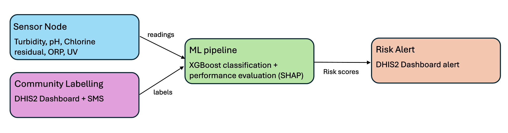
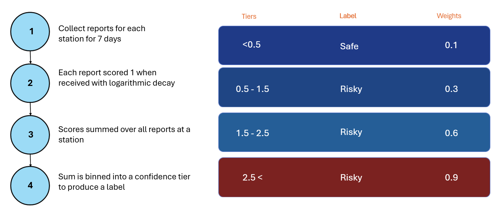
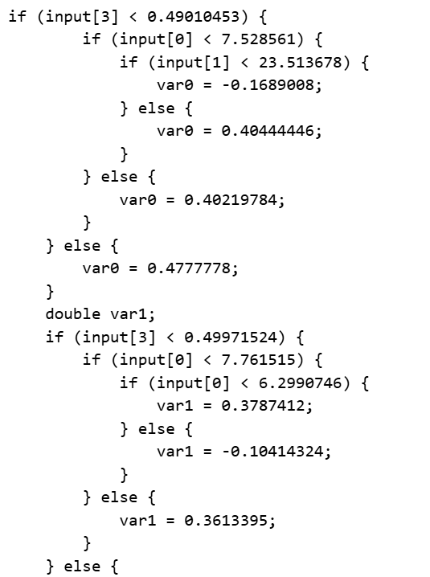

## Problem Specification: ​

80% of water consumption in Harare, Zimbabwe is from unregulated boreholes.​ Faecal contamination leads to waterborne disease outbreaks Allen's initial design involved a multi-sensor proxy based methods for detecting water contamination, a gap in the research space with lots of potential as ML methods rapidly improve.

The issues he had with his initial trial included:
- The fuzzy logic algorithm used collapsed on single sensor failure.
- The chosen proxies were insufficient to predict contamination.​
- Chlorine dosing is a high stakes output:​
    * Too much is toxic.​
    * Too little is ineffective.​

## Our Solution: A report-labelled water safety pipeline

 Informed by a literature review, data analysis and Allen Chafa's challenges with his first trial, we designed and began implementing a system architecture.

Decision Justification

- DHIS2 Dashboard - 
    * Widely used, tried and tested​
    * Many VHWs already trained to use it​
    * Incorporates SMS capabilities and offline use 

- SMS - anyone can report without visiting a clinic or using a smartphone

- XGBoost Classifier - Capable of detecting complex, non-linear relationships between readings and water potability while natively handling missing data and sensor drift. Importantly, it is also compressable to a file size within the memory capacities of simple microcontrollers, including an Arduino.

## Technical summary

### Labelling logic

Design Justification

- 7 day window - WHO Cholera incubation up to 5 days. Adding a 2 day reporting window, gives a 7 day rolling window.
- Discrete confidence tiers (thresholds are arbitrary and need calibration as data comes in)
    * Transparent and easy to update as understanding improves.
    * Sustained reporting, increases contamination likelihood. ​
    * No reports ≠ safe water. Low weighting used. ​
    * The 0.5 safe threshold is designed to filter out background illness reports.
- Logarithmic decay - Most cases present within 48 hours, so recent reports should carry more weight than older ones.

### ML pipeline
XGBoost pipeline trained on synthetic data, ready to retrain when field data accumulates​. Easilt understandable performance evaluation metrics built in.

Model exported to C via m2cgen for offline inference on the sensor node

### Dashboard (Version 1)

The UI, composed of two dashboards for each of the governance and medical side of the healthcare system, went through two iterations. The first was developed using HTML. Screenshots of the dashboard are presented below, but it can also be accessed [here](gm2aquasolutions-production-aff9.up.railway.app). 

**Government Dashboard:**

The government dashboard provides users with the opportunity to see the live water quality data which was simulated using [simulation.py](App/dhis2/etl/simulate.py) at each borehole. Each of these, based on previous medical reports, is also labelled as safe or unsafe using the green or red status pill. There are a few fake buttons for sending teams to collect a lab sample or shut down the borehole. These buttons are not functional, but were used as demonstrations of what could be done if the system were integrated into a multi-departmental organisation. On the right hand side, the history of medical reports and SMS notifications at various boreholes are summarised. Each of these contains a mini dataset obtained at the time of the event, but which has not yet been through our proposed labelling pipeline. 

**Medical Dashboard:**

The medical dashboard illustrates a map of Harare and all of the simulated boreholes we have placed throughout the city. Each one is weighted, both in size and opacity, by the number of illness reports at each of these locations. A tab offers the opportunity to fill out a health form, and a summary of the previous reports is located at the bottom of the dashboard. 

### DHIS2 Webpage

After some further research into the digital healthcare situation in Zimbabwe and feedback from both GM2 supervisors and Mr.Chafa, we developed a second version of the UI. We focused on improving the visibility. How can we use the space more efficiently to communicate key health and water quality metrics? 
