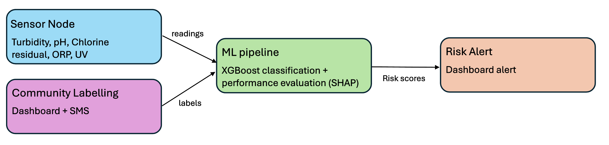

##Problem Specification: ​

80% of water consumption in Harare, Zimbabwe is from unregulated boreholes.​ Faecal contamination leads to waterborne disease outbreaks.

Allen's initial design involved a multi-sensor proxy based methods for detecting water contamination, a gap in the research space with lots of potential as ML methods rapidly improve.

The issues he had with his initial trial included:
The fuzzy logic algorithm used collapsed on single sensor failure.
The chosen proxies were insufficient to predict contamination.​
Chlorine dosing is a high stakes output:​
    Too much is toxic.​
    Too little is ineffective.​

##Our Solution: A report-labelled water safety pipeline

 Informed by a literature review, data analysis and Allen Chafa's challenges with his first trial, we designed and began implementing a system architecture.

 

Decision Justification

SMS - 

XGBoost Classifier - Capable of detecting complex, non-linear relationships between readings and water potability while natively handling missing data and sensor drift. Importantly, it is also compressable to a file size within the memory capacities of simple microcontrollers, including an Arduino.

##Technical summary