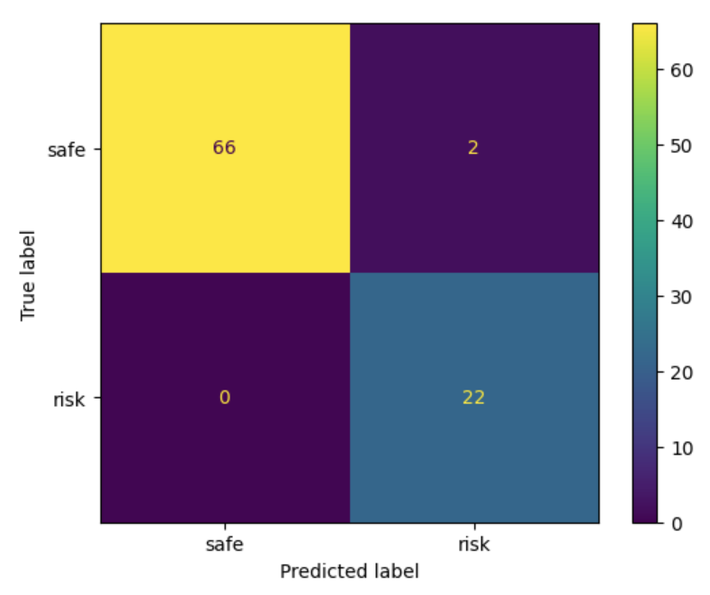
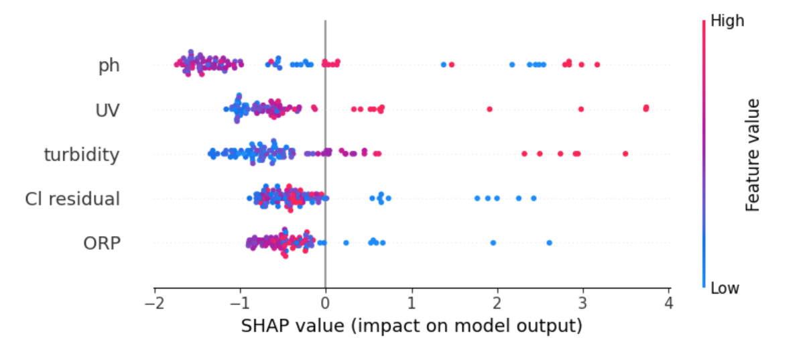

## Problem Specification: ​

80% of water consumption in Harare, Zimbabwe is from unregulated boreholes.​ Faecal contamination leads to waterborne disease outbreaks Allen's initial design involved a multi-sensor proxy based methods for detecting water contamination, a gap in the research space with lots of potential as ML methods rapidly improve.

The issues he had with his initial trial included:
- The fuzzy logic algorithm used collapsed on single sensor failure.
- The chosen proxies were insufficient to predict contamination.​
- Chlorine dosing is a high stakes output:​
    * Too much is toxic.​
    * Too little is ineffective.​

## Our Solution: A report-labelled water safety pipeline

 Informed by a literature review, data analysis and Allen Chafa's challenges with his first trial, we designed and began implementing a system architecture.

Decision Justification

- DHIS2 Dashboard - 
    * Widely used, tried and tested​
    * Many VHWs already trained to use it​
    * Incorporates SMS capabilities and offline use 

- SMS - anyone can report without visiting a clinic or using a smartphone

- XGBoost Classifier - Capable of detecting complex, non-linear relationships between readings and water potability while natively handling missing data and sensor drift. Importantly, it is also compressable to a file size within the memory capacities of simple microcontrollers, including an Arduino.

## Technical summary

### Labelling logic

Design Justification

- 7 day window - WHO Cholera incubation up to 5 days. Adding a 2 day reporting window, gives a 7 day rolling window.
- Discrete confidence tiers (thresholds are arbitrary and need calibration as data comes in)
    * Transparent and easy to update as understanding improves.
    * Sustained reporting, increases contamination likelihood. ​
    * No reports ≠ safe water. Low weighting used. ​
    * The 0.5 safe threshold is designed to filter out background illness reports.
- Logarithmic decay - Most cases present within 48 hours, so recent reports should carry more weight than older ones.

### ML pipeline
XGBoost pipeline trained on synthetic data, ready to retrain when field data accumulates​. Easily understandable performance evaluation metrics are built in, including a Classification report, Confusion matrix, ROC Curve, AUC Score and SHAP Feature analysis. Each has a non-technical user friendly explanation attached. Note that the classifier carries out near perfect classification on the synthetic test set but this does not completely reflect its ability to cope with real data, except for validating that XGBoost is capable of detecting non-linear trends.

The confusion matrix shows the model's predictions against the true labels for each reading in the test set. The most important cell is bottom left. A missed risk means contaminated water goes unflagged without triggering an alert. The goal is to minimise this number as much as possible.

Model exported to C via m2cgen for offline inference on the sensor node. Below is one tree (of 100):

### Dashboard

# SDG and UNICEF Digital Design Principles Reflection
This project addresses the fundamental issue of access to safe water faced in many developing countries, and therefore looks to tackle **SDG 6**; Clean Water and Sanitation. The target location was Harare, Zimbabwe but the principles and methods in this project are directly applicable to many places that rely on unreliable borehole-sourced water. While odour, taste and sufficient quantities of water are a concern, the primary issue is water-borne diseases. Reliable, fast and robust detection of water safety is essential to preventing the spread of illness and preserving the health of the people that rely on these boreholes (**SDG 3** - Good Health and Well-Being). In developing countries, illness has a wider impact than in wealthier economies as civilians lack the same medical infrastructure and financial support, resulting in the devastation of livelihoods and increasing existing inequalities (**SDG 10** - Reduced Inequality).

Our solution involved developing a sensor-based approach data collection and labelling system through community-illness reports to train an edge-ML algorithm for potability prediction (**SDG 9** - Industry, Innovation and Infrastructure). Given the digital nature of the solution, UNICEF's principles for **Digital Development** were central to our approach. In order to **understand the ecosystem**, we had regular meetings with Allen (**Design with people**) to discuss the setbacks and weaknesses of his initial design and to receive feedback on our proposed solutions. He informed us of the current water situation in Harare and we adjusted our solutions appropriately. We adapted to the infrastructure realities and explored system architecture options, particularly whether our device would function at the house or village level, and reporting mechanism alternatives, settling for a combination of SMS and a web interface. We explored the health and medical procedures currently used in Zimbabwe and were able to integrate our interface with DHIS2, a leading medical data management system in Zimbabwe. Our proposal requires participation from Village Health Workers with whom we will look to form future partnerships to enable a solution and acquire further feedback during field implementation (**SDG 17** - Partnerships for the goals).

By building off Allen's initial design, we hoped to **'share, reuse and improve'**, keeping many of the initial working design elements while replacing the fragile fuzzy logic algorithm and removing the high stakes chlorine release system. We based our repository on open-source material like the XGBoost or m2cgen libraries, met regularly with supervisors and co-designer (Allen Chafa) and documented all decision making. We wrote a clear AI Declaration and used transparent logic for work, including confidence tiers, that could be easily altered or built off (**Clear, open and transparent practices**).

**Using evidence to improve outcomes** sits at the core of XGBoost-driven solution, designed to improve as more data arrives with confidence intervals directly paired to degree of evidence. The XGBoost method has in-built performance metrics for a user to easily understand. We have looked to **anticipate and mitigate harm** through a lightly-weighted safety reading, which tackles the key issue of false negatives. Absence of reports does not equal safe water and care will need to be used when selecting labelling thresholds in future to maintain this principle. Further steps will involve matching symptoms to diseases and potentially some lab based labelling to improve evidence reliability for initial training. When devising the labelling methodology, we considered the principles of **design for inclusion** and **establishing people first data practices** by implementing SMS reporting, with no requirement for a strong internetconnection, while keeping messages anonymous to avoid privacy issues.

